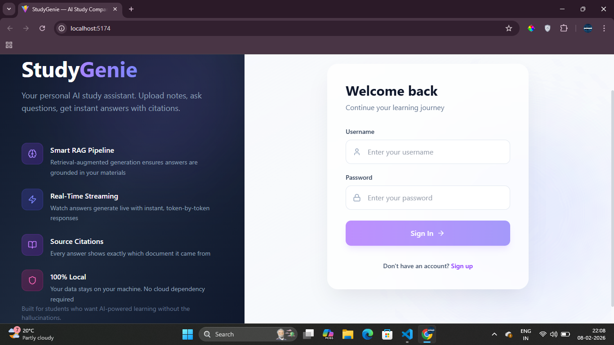
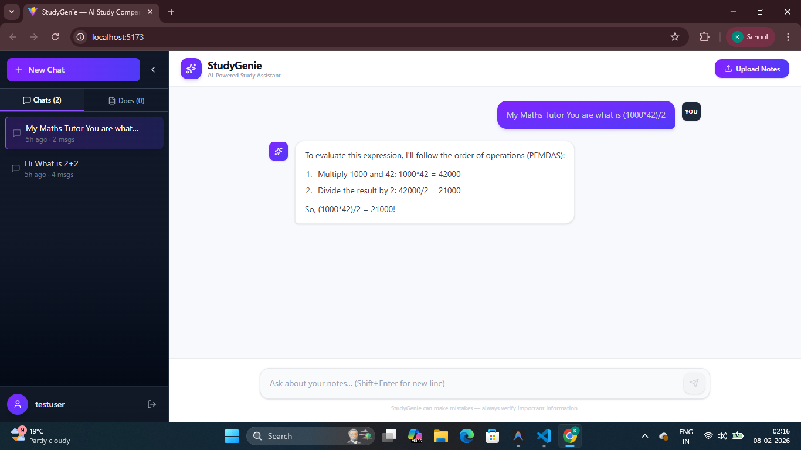

# StudyGenie — RAG-Based AI Study Assistant

StudyGenie is a **local-first**, full-stack Generative AI study assistant that lets you upload your notes (PDFs, text files, markdown) and ask questions about them in a chat interface. It uses **Retrieval-Augmented Generation (RAG)** to give you accurate, source-cited answers grounded in your actual study materials — not hallucinated responses.

This project explores real-world GenAI trade-offs — how RAG works end-to-end, how local models behave under real constraints, and how to build reliable, grounded responses with source citations.

> **Why local-first?** This project intentionally runs on a local open-source LLM via [Ollama](https://ollama.com) to explore the real-world constraints of GenAI systems — latency, inference cost, model limitations, and how AI performs outside ideal cloud environments. No paid API is required to run this.

> **Note:** This project is designed to run locally and is not deployed publicly to avoid reliance on paid APIs.

---

## Screenshots

| Login | Chat with Streaming | RAG Answer with Sources |
|-------|---------------------|-------------------------|
|  |  |  |

> **To add screenshots:** Take screenshots of the Login page, Chat interface, and a RAG answer showing sources, then save them as `screenshots/login.png`, `screenshots/chat.png`, and `screenshots/sources.png`.

---

## How It Works

```
User uploads notes ──► Text split into chunks ──► Embedded into vectors ──► Stored in FAISS
                                                                                │
User asks a question ──► Smart Router decides: needs docs?                      │
          │                    │                                                │
          │              YES ──► Embed query ──► FAISS similarity search ◄──────┘
          │                    │                         │
          │                    │              Relevant chunks as context
          │                    │                         │
          │               NO ──┼─────────────────────────┤
          │                    │                         ▼
          └────────────────────┴──────────► LLM generates answer (streamed)
                                                         │
                                                    Chat bubble ◄── tokens arrive in real-time
```

1. **Upload** — Drop a PDF, `.txt`, or `.md` file → split into chunks → embedded into vectors
2. **Ask** — Smart router decides: search your docs (RAG) or answer directly (math, greetings, general knowledge)
3. **Retrieve** — Question is embedded → FAISS finds the most relevant chunks → irrelevant matches filtered by a score threshold
4. **Generate** — Context + question + chat history → LLM → response streamed token-by-token in real-time
5. **Cite** — Collapsible source tags show exactly which document each answer came from

---

## Tech Stack

| Layer | Technology | Purpose |
|-------|-----------|---------|
| **Frontend** | React 19, TypeScript, Vite | Single-page app with hot reload |
| **Styling** | Tailwind CSS 4 | Responsive UI with violet theme |
| **Chat Rendering** | React Markdown, KaTeX | Renders math equations, code blocks, lists |
| **Backend** | FastAPI (Python 3.12) | REST API + SSE streaming |
| **Authentication** | JWT + bcrypt | Secure login/register |
| **Database** | SQLite + SQLAlchemy | Users, sessions, messages, documents |
| **Vector Store** | FAISS (Facebook AI Similarity Search) | Fast similarity search on document embeddings |
| **Embeddings** | Ollama `nomic-embed-text` | Converts text → vector representations |
| **LLM (Chat)** | Ollama `llama3` (local, default) | Generates answers from context |
| **LLM (Optional)** | Google Gemini 2.0 Flash | Cloud alternative with auto-fallback |
| **Orchestration** | LangChain | Ties the RAG pipeline together |
| **Streaming** | Server-Sent Events (SSE) | Real-time token delivery to frontend |

---

## Features

- **RAG Pipeline** — Answers grounded in your uploaded documents, not hallucinated
- **100% Local Mode** — Runs entirely on your machine via Ollama, no API key needed
- **Streaming Responses** — Tokens appear in real-time, no waiting for full generation
- **Smart Query Routing** — Simple questions (math, greetings) skip the RAG pipeline for instant answers
- **Relevance Filtering** — Only shows source citations when documents are actually relevant
- **JWT Authentication** — Secure login/register with hashed passwords
- **Multi-Session Chat History** — Conversations are saved and resumable
- **Document Management** — Upload, list, and delete study materials
- **Math Support** — Renders LaTeX equations with KaTeX
- **Dual LLM Support** — Optional Gemini API as primary with automatic Ollama fallback

---

## Project Structure

```
StudyGenie/
├── backend/
│   ├── app/
│   │   ├── main.py                 # FastAPI app entry point
│   │   ├── api/
│   │   │   ├── api.py              # Router aggregation
│   │   │   └── endpoints/
│   │   │       ├── auth.py         # Login / Register
│   │   │       ├── chat.py         # Chat + Streaming + Smart Routing
│   │   │       └── documents.py    # Upload / List / Delete docs
│   │   ├── core/
│   │   │   ├── config.py           # Settings (reads .env)
│   │   │   ├── database.py         # SQLAlchemy models + DB setup
│   │   │   └── auth.py             # JWT token creation/validation
│   │   ├── models/
│   │   │   ├── chat.py             # Pydantic schemas for chat
│   │   │   └── document.py         # Pydantic schemas for documents
│   │   └── services/
│   │       ├── ingestion.py        # Document chunking + processing
│   │       └── rag.py              # FAISS vector store + embeddings
│   ├── requirements.txt
│   ├── .env.example
│   └── Dockerfile
├── frontend/
│   ├── src/
│   │   ├── main.tsx                # React entry point
│   │   ├── App.tsx                 # Root component (auth check)
│   │   ├── index.css               # Global styles
│   │   ├── api/
│   │   │   └── client.ts           # API client + SSE streaming
│   │   └── components/
│   │       ├── AuthPage.tsx         # Login / Register page
│   │       ├── ChatInterface.tsx    # Main chat with streaming
│   │       └── Sidebar.tsx          # Sessions + Documents panel
│   ├── package.json
│   ├── vite.config.ts
│   └── index.html
├── docker-compose.yml
├── .gitignore
└── README.md
```

---

## Prerequisites

- **Python 3.12+**
- **Node.js 18+** and **npm**
- **Ollama** — Download from [ollama.com](https://ollama.com)

---

## How to Run Locally

### 1. Install Ollama and pull the models

```bash
# Install Ollama from https://ollama.com, then:
ollama pull llama3
ollama pull nomic-embed-text
```

Make sure Ollama is running:
```bash
ollama serve
```

### 2. Set up the Backend

```bash
cd backend

# Create virtual environment
python -m venv venv
venv\Scripts\activate        # Windows
# source venv/bin/activate   # macOS/Linux

# Install dependencies
pip install -r requirements.txt

# Create your .env file
copy .env.example .env       # Windows
# cp .env.example .env       # macOS/Linux

# Start the server
uvicorn app.main:app --host 0.0.0.0 --port 8000 --reload
```

The backend API will be available on port `8000`.

### 3. Set up the Frontend

```bash
cd frontend

# Install dependencies
npm install

# Start dev server
npm run dev
```

### 4. Use the App

1. Open **http://localhost:5173** in your browser
2. **Register** a new account (stored locally in SQLite)
3. **Upload** your study notes (PDF, TXT, or MD files)
4. **Ask questions** — the AI will answer based on your uploaded materials

---

## Optional: Use Gemini API (faster responses)

If you have a Google Gemini API key (free tier available):

1. Get a key at [aistudio.google.com/apikey](https://aistudio.google.com/apikey)
2. Add it to `backend/.env`:
   ```
   GEMINI_API_KEY=your_key_here
   LLM_PROVIDER=gemini
   ```
3. Restart the backend — Gemini will be used for chat with automatic Ollama fallback if quota is exceeded.

---

## Limitations

- **Slower responses with Ollama** — Local LLM inference depends on your hardware (GPU recommended but not required)
- **Embedding cold start** — First query after starting the server takes ~2-3s as the embedding model warms up; subsequent queries are fast (~0.2s)
- **Small context window** — Local models have limited context compared to cloud APIs
- **Single user focus** — Designed as a personal study tool, not a multi-tenant SaaS

---

## What I Learned

Building this project taught me:

- How **RAG pipelines** work end-to-end — chunking, embedding, retrieval, and generation
- The real-world trade-offs of **local vs cloud LLMs** (latency, quality, cost)
- How to implement **SSE streaming** for real-time token delivery
- **Smart query routing** to avoid unnecessary expensive operations
- **Relevance filtering** with vector similarity scores to prevent hallucinated citations
- Building a **full-stack app** with React + FastAPI + SQLAlchemy + FAISS

This project deepened my understanding of latency, model quality trade-offs, real-time streaming systems (SSE), and multi-model integration in production-like settings.

---

## License

MIT — feel free to use, modify, and learn from this project.
